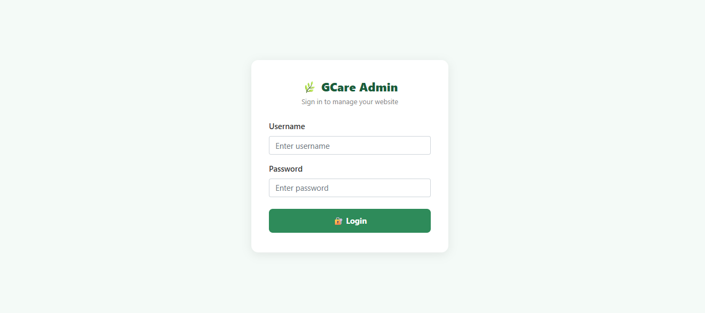
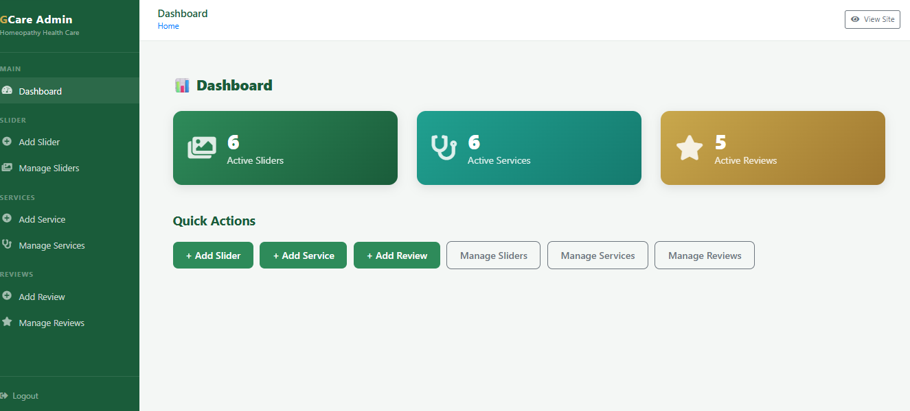

# 🌿 GCare Homeopathy — CMS Web Application

A full-stack Clinical Management System (CMS) built for a 
homeopathy clinic using PHP and CodeIgniter 3. It includes 
a public-facing homepage and a secure admin panel to manage 
sliders, services, and patient reviews.

---

## 🌐 Live Demo

 🔗 **Website:** https://gcarewebsite.42web.io

 🔐 **Admin Panel:** https://gcarewebsite.42web.io/auth/login


### Demo Admin Credentials (For Evaluation Only)

- **Username:** `admin`
- **Password:** `password123`

## 📸 Screenshots

### 🏠 Home Page


### 🔐 Admin Login


 
### Admin Dashboard



## 🛠️ Tech Stack

| Layer      | Technology                        |
|------------|-----------------------------------|
| Language   | PHP 7.4+                          |
| Framework  | CodeIgniter 3                     |
| Database   | MySQL                             |
| Frontend   | Bootstrap 4, jQuery, Font Awesome |
| Server     | Apache (XAMPP local / InfinityFree live) |
| Version Control | Git & GitHub                 |

---

## ✨ Features

### Public Frontend
- 🖼️ Dynamic image slider (carousel) with title and subtitle
- 🏥 Services section with icon and image cards
- ⭐ Patient reviews with star rating display
- 💬 Floating WhatsApp button for quick appointment booking
- 📱 Fully responsive design for mobile and desktop
- 🔽 Smooth scroll navigation

### Admin Panel
- 🔐 Secure login with session-based authentication
- 📊 Dashboard with active counts for sliders, services, reviews
- ➕ Add / ✏️ Edit / 🗑️ Delete Sliders with image upload
- ➕ Add / ✏️ Edit / 🗑️ Delete Services with icon and image
- ➕ Add / ✏️ Edit / 🗑️ Delete Reviews with optional photo
- 🔄 Active/Inactive status toggle for all content

---

## 🗄️ Database Tables

| Table      | Columns                                              |
|------------|------------------------------------------------------|
| slider     | id, title, subtitle, image, status, created_at       |
| service    | id, name, description, icon, image, status, created_at |
| review     | id, patient_name, review, rating, photo, status, created_at |
| ci_sessions| id, ip_address, timestamp, data                      |

---


## 🚀 Installation

### Clone the Repository

```bash
git clone https://github.com/Abirami-2408/GCare-Homeopathy-Clinic.git
```

### Import Database

- Open phpMyAdmin
- Create a database
- Import the provided SQL file


## 📂 Project Structure

```
MyProject/
├── .htaccess                    ← URL rewriting (removes index.php)
├── index.php                    ← CodeIgniter front controller
├── assets/
│   └── uploads/
│       ├── sliders/             ← Slider images stored here
│       ├── services/            ← Service images stored here
│       └── reviews/             ← Review photos stored here
└── application/
├── controllers/
│   ├── Home.php             ← Public frontend
│   ├── Admin.php            ← Admin CRUD operations
│   └── Auth.php             ← Login / Logout
├── models/
│   ├── Slider_model.php
│   ├── Service_model.php
│   └── Review_model.php
└── views/
├── frontend/
│   └── home.php         ← Public homepage
├── admin/
│   ├── dashboard.php
│   ├── slider/
│   ├── service/
│   └── review/
└── auth/
└── login.php

```
---

## 🎯 Internship Project

This project was developed as part of a Full Stack Web Development Internship to gain practical experience in building dynamic web applications using PHP, CodeIgniter, and MySQL.

---

## 📈 Future Improvements

- Appointment Management
- Email Notifications
- Search & Filter
- Pagination
- Better Authentication
- Password Hashing
- Admin Profile Management

---

## 👨‍💻 Author

**Abirami R K**

- GitHub: https://github.com/Abirami-2408
- LinkedIn: https://linkedin.com/in/abiramirk

---

## 📄 License

This project is developed for educational and internship purposes.
